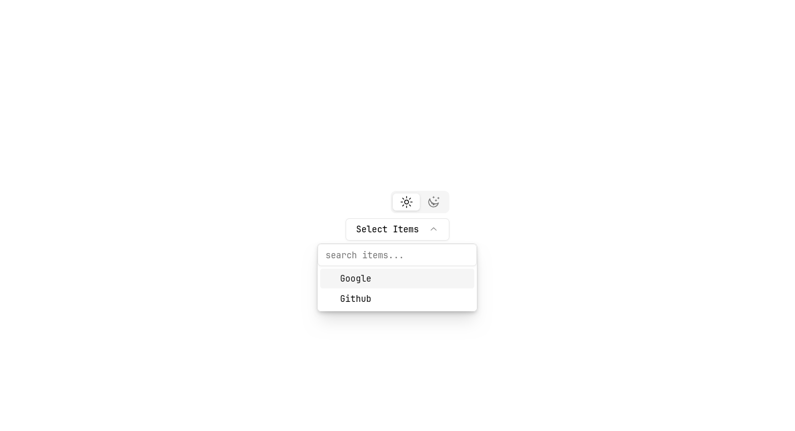

# [Abstract UI](https://abstract-ui-olive.vercel.app)

Abstract UI is a component library for React and Next.js written in TypeScript. It contains a
variety of components to help you build your web applications faster and more efficiently.

## Components

- [Breadcrumbs](./breadcrumbs)
- [Command Palette](./command-palette)
- [Content Copy](./content-copy)
- [Date Picker](./date-picker)
- [Expandable Text Area](./expandable-text-area)
- [Filter Dropdown](./filter-dropdown)
- [Image Input](./image-input)
- [Login Form](./login-form)
- [Pagination](./pagination)
- [Show More](./show-more)
- [Signup Form](./signup-form)
- [Theme Switcher](./theme-switcher)

## Screenshots

Below are the screenshots for each component in both light and dark themes.

### Breadcrumbs


### Command Palette


### Content Copy


### Date Picker


### Expandable Text Area


### Filter Dropdown




### Image Input


### Login Form


### Pagination


### Show More


### Signup Form


### Theme Switcher


## Installation

To install the library, run:

```bash
npm install @silentfellow/abstract-ui
```

## Usage

To use a component, import it into your project:

```typescript
import { Breadcrumbs } from 'abstract-ui';

function App() {
  return (
    <div>
      <Breadcrumbs />
    </div>
  );
}

export default App;
```

## Documentation

For detailed documentation, please visit
[Abstract UI Documentation](https://abstract-ui.onrender.com).

## Contributing

Contributions are welcome! Please open an issue or submit a pull request.

## License

This project is licensed under the MIT License.
